# 📸 Documentation Visuelle - Interface Utilisateur

## Vue d'ensemble des pages

Ce document fournit un aperçu visuel des différentes pages et interfaces de l'application Property Booking.

Si les images ne s'affichent pas :
- [Voir la documentation](https://drive.google.com/drive/folders/1LBIa2ai4Vk9RSD6cYrelgeD5p2edR-bc)
---

## 1. 🏠 Page d'Accueil (`/`)

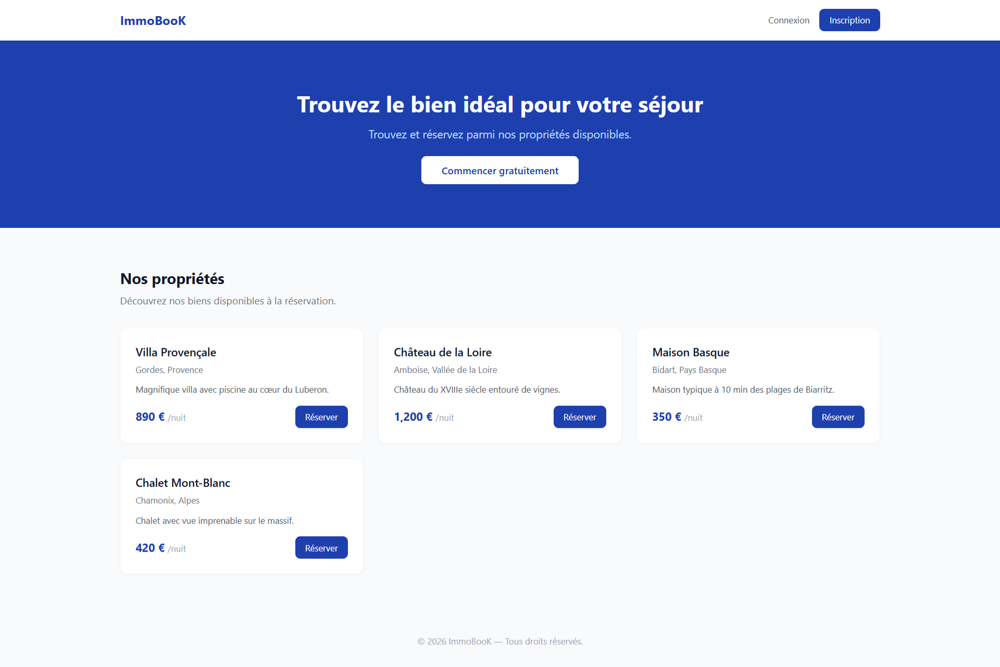

- Liste des propriétés disponibles
- Affichage des propriétés avec prix et localisation
- Boutons pour consulter les détails et réserver
- Navigation vers inscription/connexion

---

## 2. 📝 Page d'Inscription (`/register`)

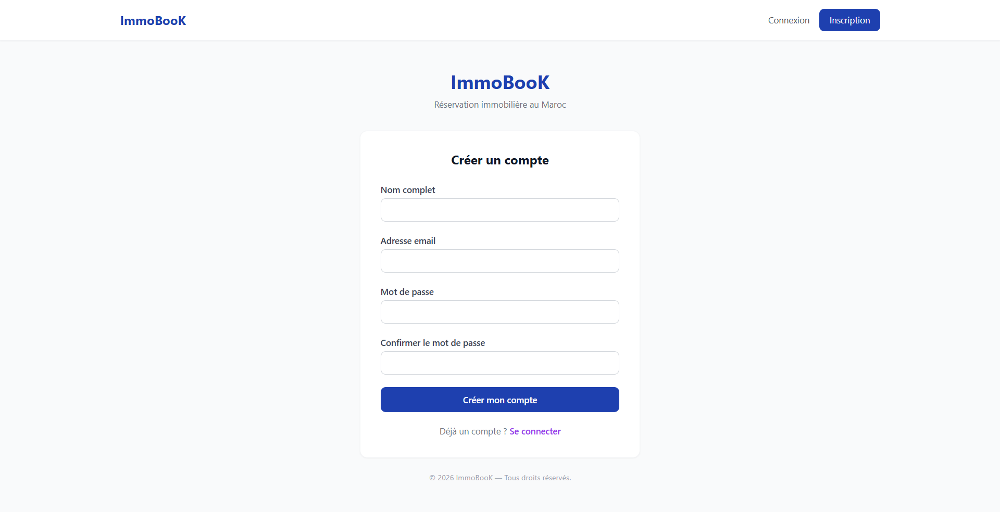

- Formulaire d'enregistrement utilisateur
- Champs: Nom, Email, Mot de passe, Confirmation
- Validation des données
- Lien vers la connexion existante

---

## 3. 🔐 Page de Connexion (`/login`)

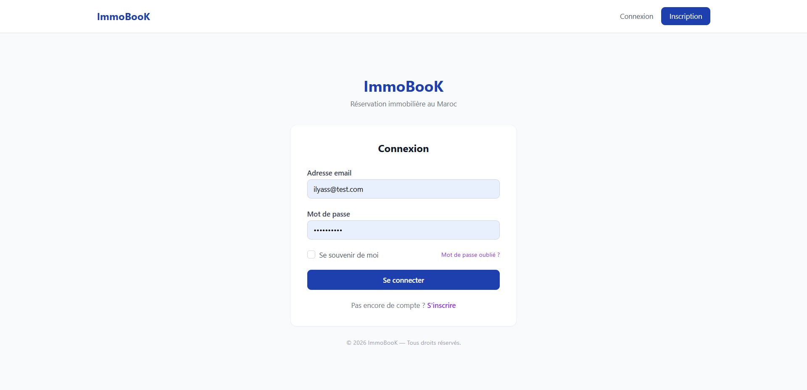

- Formulaire de connexion
- Champs: Email et Mot de passe
- Option "Se souvenir de moi"
- Lien vers inscription pour nouveaux utilisateurs

---

## 4. 📊 Dashboard Utilisateur (`/dashboard`)

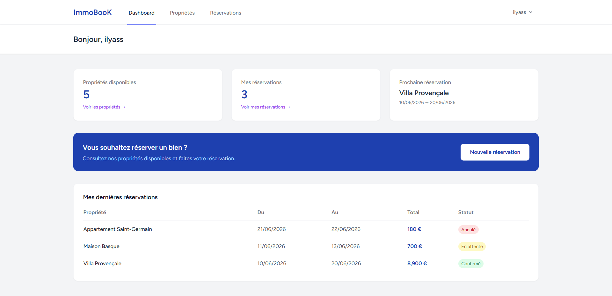

**Conteneur :**
- Bienvenue utilisateur
- Statistiques personnalisées:
  - Nombre de réservations total
  - Nombre de propriétés disponibles
  - Prochaine réservation confirmée
- Liste des 3 réservations récentes

**Affichage :**
- Cartes récapitulatives
- Historique des réservations
- Détails de la prochaine visite

---

## 5. 🛏️ Page de Réservation (`/properties/{id}/book`)

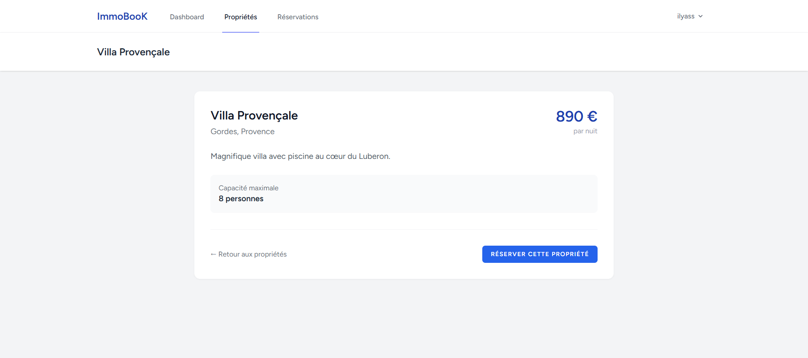

- Détails de la propriété sélectionnée
- Formulaire de réservation:
  - Sélection date d'arrivée
  - Sélection date de départ
  - Nombre de clients
- Calcul automatique du prix total
- Bouton de confirmation

---

## 6. 📋 Page de Gestion des Réservations

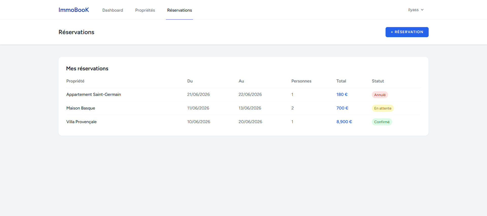

- Vue liste des réservations de l'utilisateur
- Informations affichées:
  - Nom de la propriété
  - Dates de réservation
  - Statut (pending, confirmed, cancelled)
  - Prix total
- Actions: Consulter, Modifier, Annuler

---

## 7. 👨‍💼 Dashboard Admin Panel (Filament)

### Page d'accueil Admin

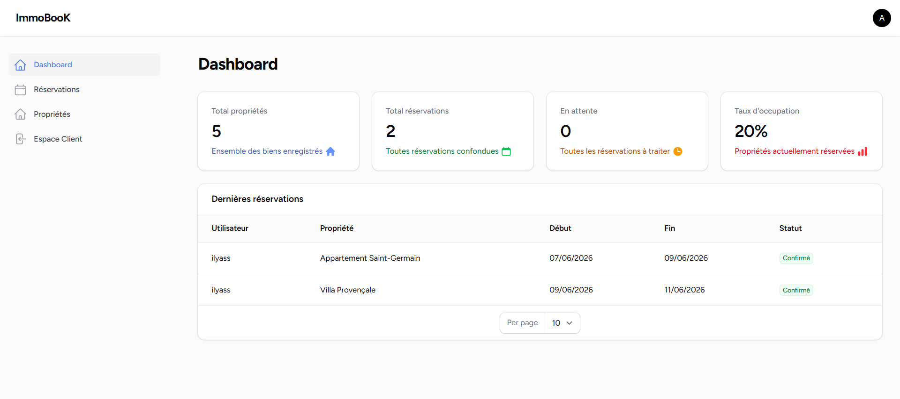

Affiche:
- Statistiques clés du système
- Widgets de suivi
- Raccourcis vers gestion des ressources

### Gestion des propriétés

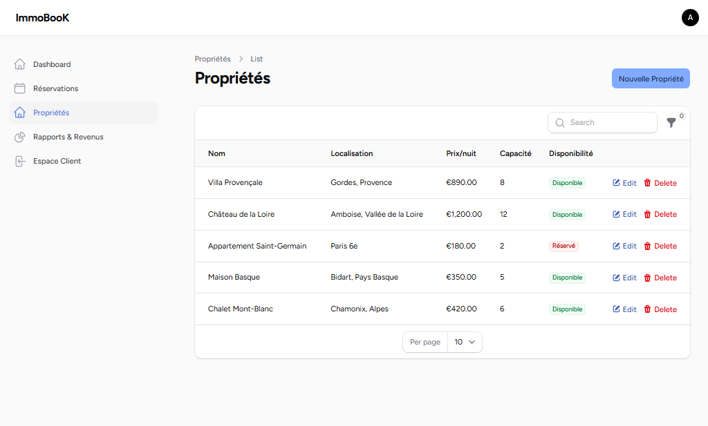

Vue Filament pour:
- Lister toutes les propriétés
- Créer/Éditer propriétés:
  - Nom
  - Description
  - Prix par nuit
  - Localisation
  - Nombre maximum de clients
- Supprimer des propriétés
- Filtrer/Rechercher

### Gestion des réservations

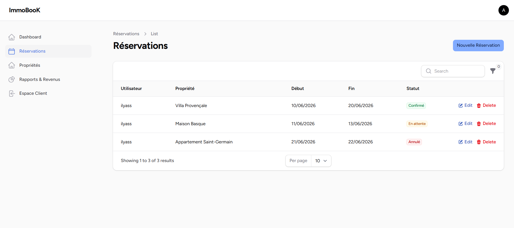

Permet de:
- Voir toutes les réservations
- Détails complets de chaque réservation
- Modifier le statut (pending → confirmed → cancelled)
- Voir l'utilisateur et la propriété
- Calculer et afficher les revenus

### Espace Client

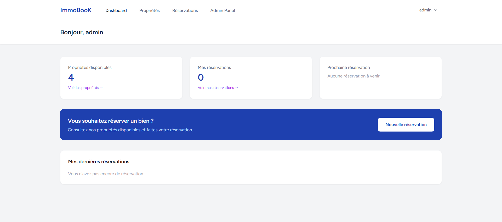

Remarque : cette capture montre le même dashboard que l'espace client. La seule différence visuelle est la présence, dans la barre de navigation, d'un lien «Admin Panel (Filament)». Le tableau de bord affiche :
- Statistiques globales
- Nombre total de réservations
- Revenus totaux
- Taux d'occupation
- Graphiques et indicateurs clés

### Suivi des revenus

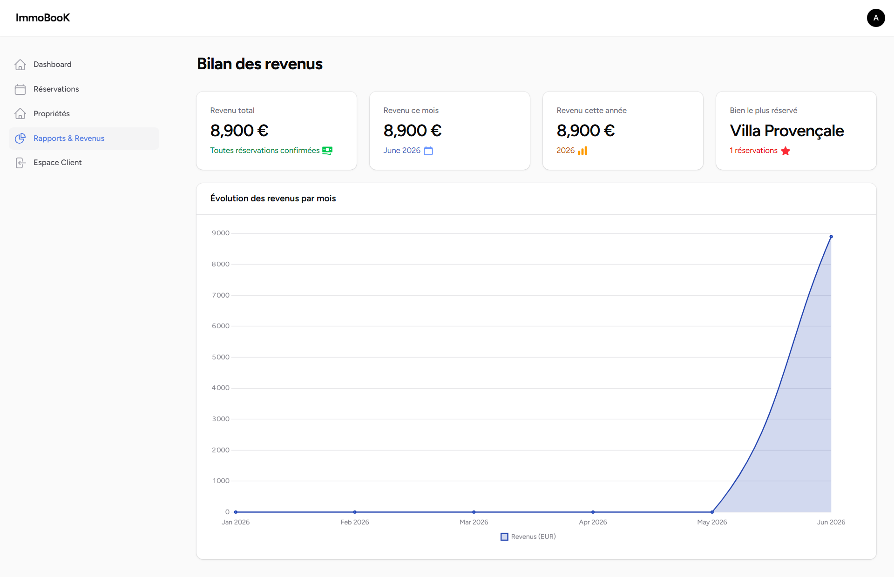

Permet de:
- Consulter les revenus par période
- Analyser les revenus par propriété
- Voir les tendances
- Générer des rapports

---

## 🔄 Flux utilisateur

### Nouveau client

1. **Page d'accueil** → Voir les propriétés
2. **Page de réservation** → Sélectionner dates et confirmer
3. **Inscription** → Créer un compte
4. **Dashboard** → Consulter les réservations

### Client existant

1. **Connexion** → Accéder au compte
2. **Dashboard** → Voir les réservations
3. **Réservation** → Booker une nouvelle propriété
4. **Gestion réservations** → Modifier/annuler

### Administrateur

1. **Connexion Admin** → /admin
2. **Dashboard** → Vue d'ensemble des statistiques
3. **Gestion des ressources** → Properties, Bookings, Users
4. **Rapports** → Revenus et statistiques

---

## 🎨 Éléments visuels

### Palettes de couleurs
- Couleur primaire: Tailwind (à définir dans `tailwind.config.js`)
- Fond: Gris clair
- Texte: Gris foncé

### Composants réutilisables
- Cartes (Cards)
- Boutons (Buttons)
- Formulaires (Forms)
- Modales (Modals)
- Alertes (Alerts)

### Icônes et symboles
- Filament fournit des icônes via `blade-ui-kit`
- Utilisation cohérente des icônes FontAwesome ou Heroicons

---

## 📱 Responsive Design

L'application est responsive via **Tailwind CSS** et s'adapte à:
- **Desktop** (1024px+)
- **Tablet** (640px - 1024px)
- **Mobile** (< 640px)

---

## 🔐 Contrôle d'accès

### Pages publiques
- `/` - Page d'accueil
- `/register` - Inscription
- `/login` - Connexion

### Pages protégées (utilisateur authentifié)
- `/dashboard` - Dashboard personnel
- `/properties/{id}/book` - Réservation
- `/profile` - Profil utilisateur

### Pages administrateur
- `/admin` - Panel Filament (admin uniquement)
- `/admin/properties` - Gestion des propriétés
- `/admin/bookings` - Gestion des réservations
- `/admin/users` - Gestion des utilisateurs

---

## ✨ Fonctionnalités avancées

### Real-time avec Livewire
- Mise à jour en temps réel des disponibilités
- Validation en direct des formulaires
- Actions sans rechargement de page

### Admin Panel Filament
- Interface CRUD complète
- Filtres et recherche avancés
- Bulk actions
- Exports de données
- Historique des modifications

### Sécurité
- Protection CSRF
- Authentification sécurisée
- Hashage des mots de passe (Bcrypt)
- Autorisation basée sur les rôles
- Prévention des vulnérabilités IDOR

---

**Dernière mise à jour:** Juin 2026
